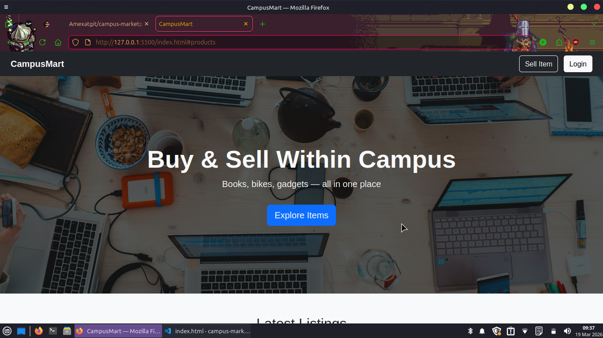

# 🛒 CampusMart

A frontend web application where students can buy and sell items within their college campus.

## About

This project was built as a mini project submission for the subject **Web Application Development (WAD)** as part of our university syllabus. The goal was to design and develop a multi-page frontend web application with a consistent theme and good UX.

## Tech Stack

- HTML5, CSS3, JavaScript
- Bootstrap 5
- localStorage (for data persistence without a backend)

## Pages

- Landing / Home page
- Login & Register
- Product listing & detail
- Sell / Add item
- And more...

## Team

Built by **Mihir**, **Sarthak**, and **Amey**.